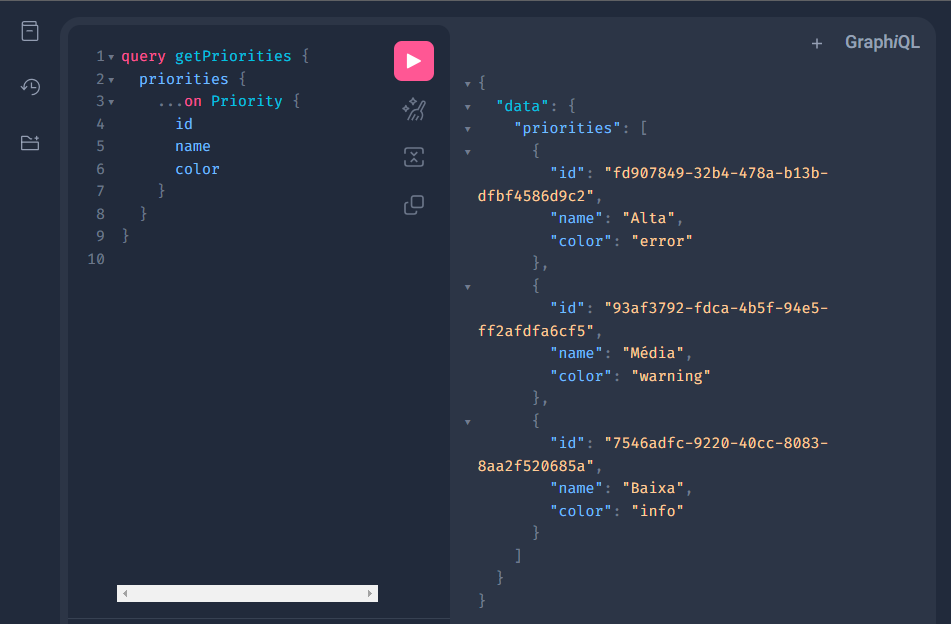

# Kanban  Data 

[](https://pypi.org/project/fastapi)
[](https://pypi.org/project/strawberry-graphql)
[](https://pypi.org/project/SQLAlchemy)
[](https://pypi.org/project/Asyncpg)




> API GraphQL que fornece os dados dos projetos para a SPA de gerenciamento de projetos usando o método Kanban ([Kanban Deploy](https://github.com/bpbastos/kanban-deploy)). Este backend foi desenvolvido utilizando as seguintes tecnologias: Python 3, FastAPI, Strawberry GraphQL, SQLAlchemy, Asyncpg e banco de dados Postgres.

> Esta API foi desenvolvida como uma parte do trabalho de conclusão do terceiro e último módulo - Desenvolvimento Backend Avançado - da Pós-Graduação em Desenvolvimento FullStack da PUC-RIO. 


## Funcionalidades

- [x] Listar quadros (Query boards).
- [x] Consultar quadro (Query board).
- [x] Listar prioridades (Query priorities).
- [x] Consultar tarefa (Query task).
- [x] Adicionar quadro (Mutation addBoard).
- [x] Adicionar prioridade (Mutation addPriority).
- [x] Adicionar tarefa (Mutation addTask).
- [x] Atualizar tarefa (Mutation updateTask).
- [x] Deletar tarefa (Mutation deleteTask).
- [x] Adicionar sub tarefa (Mutation addSubTask).
- [x] Marcar subtarefa como pronta (Mutation markSubTaskDone).
- [x] Deletar subtarefa (Mutation deleteSubTask).

## Todo

- [ ] Criar model para o usuário e evitar de usar o ID do Back4app
- [ ] Usar Dataloaders nas consultas
- [ ] Refatorar usando Clean Architecture
- [ ] Implmentar padrão de tratamento de erros
- [ ] Implmentar validação dos dados de entrada
- [ ] Implementar testes automatizados (Unitários e de segurança)
- [ ] Autenticação/Autorização via serviço de gerência de usuário ou api gateway

## 💻 Pré-requisitos

Antes de começar, verifique se o seu ambiente atende aos seguintes requisitos:

> ATENÇÃO, este backend foi desenvolvido para rodar em conjunto com o frontend [Kanban Frontend](https://github.com/bpbastos/kanban-frontend)
, o módulo de gerenciamento de usuários do [Back4App](https://www.back4app.com/) e um banco de dados Postgres. Recomendo seguir as instruções contidas no README do repositório de implantação [Kanban Deploy](https://github.com/bpbastos/kanban-deploy) para garantir uma configuração adequada.

* `Docker`

> Instalação do docker: https://docs.docker.com/engine/install/

## 🚀 Rodando

Faça clone do projeto:
```
git clone https://github.com/bpbastos/kanban-data.git
```

Acesse o diretório do projeto com:
```
cd kanban-data
```

Crie um arquivo .env na raiz do diretório kanban-data com as seguintes variáveis:

```env
KANBANFRONTEND_URL=http://localhost:3000
POSTGRES_HOST=db
POSTGRES_USER=kanban
POSTGRES_PASSWORD=kanbanpass
POSTGRES_DB=kanban
```

No diretório kanban-data em um terminal, execute para criar a instância do banco:
```sh
docker run -d --env-file ./.env -p 5432:5432 --name db postgres:16 
```

Para construir a imagem docker do projeto, execute:
```sh
docker build -t kanban-data:1.0 .
```

Para rodar o projeto, execute:
```sh
docker run -d --env-file ./.env --link db:db -p 8000:8000 --name data kanban-data:1.0 
```

ATENÇÃO, o comando abaixo deleta e recria TODAS as tabelas do projeto, execute com cautela!
```sh
docker exec --env-file ./.env data python create_db.py
```

Abra o endereço http://localhost:8000/graphql no seu navegador.
